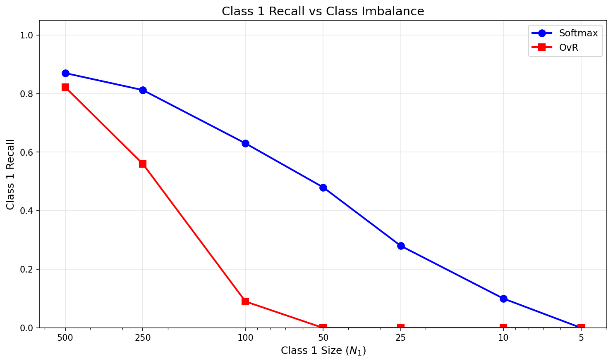
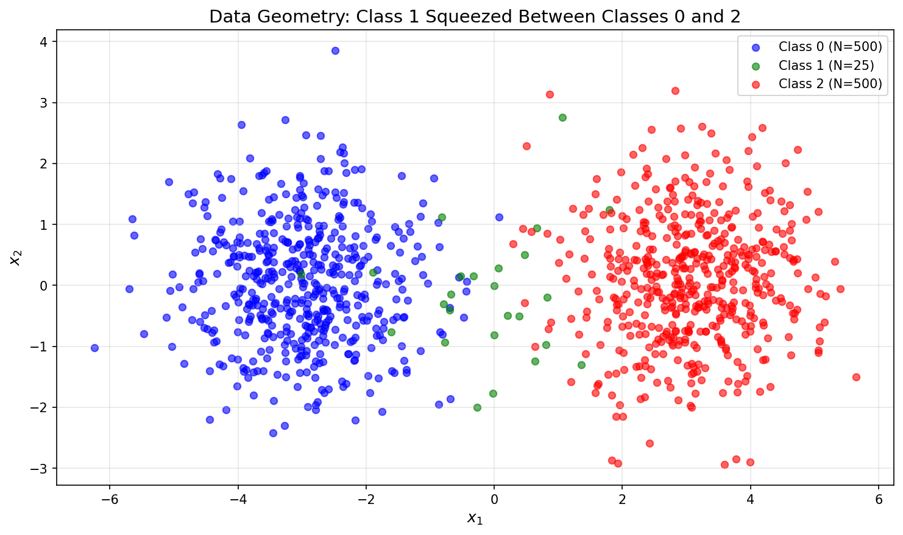
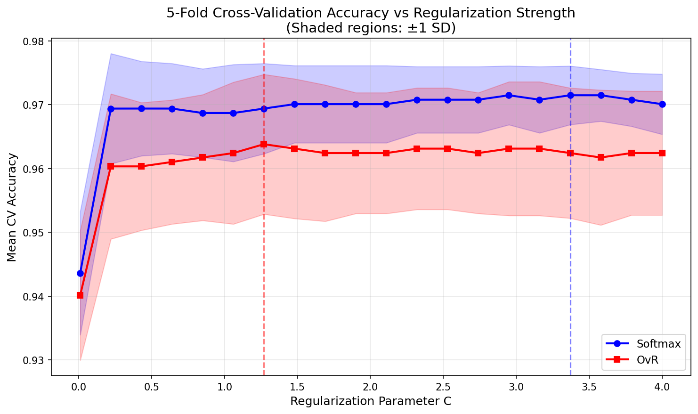
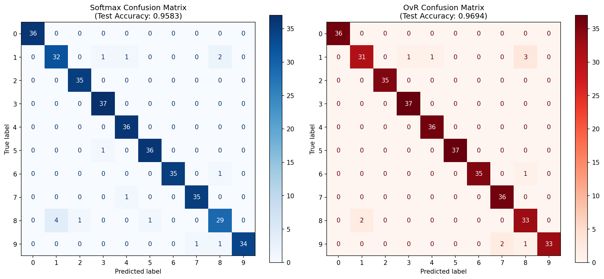

## Part (a)

### Derivation

**Step 1:**

The likelihood of observing the true label $y_i$ given our model's prediction is:
$$L_i = \prod_{k=1}^{K} p_{ik}^{y_{ik}}$$

This works because only one $y_{ik} = 1$ (the true class), and all others are 0. So this product equals $p_{ik^*}$ where $k^*$ is the true class.

**Step 2: Log likelihood**
$$\ell_i = \log L_i = \log \prod_{k=1}^{K} p_{ik}^{y_{ik}} = \sum_{k=1}^{K} y_{ik} \log(p_{ik})$$

**Step 3: Total log likelihood for dataset**

For $n$ independent observations:
$$\ell(W) = \sum_{i=1}^{n} \ell_i = \sum_{i=1}^{n} \sum_{k=1}^{K} y_{ik} \log(p_{ik})$$

**Step 4: Equivalence**

Maximizing $\ell(W)$ is equivalent to minimizing $-\ell(W)$:
$$J(W) = -\ell(W) = -\sum_{i=1}^{n} \sum_{k=1}^{K} y_{ik} \log(p_{ik})$$


## Part (b)

### Derivation

Recall:
$$J(W) = -\sum_{i=1}^{n} \sum_{k=1}^{K} y_{ik} \log(p_{ik})$$

where $p_{ik} = \frac{\exp(w_k^\top x_i)}{\sum_{j=1}^K \exp(w_j^\top x_i)}$.

**Step 1: Expand the log**
$$\log(p_{ik}) = w_k^\top x_i - \log\left(\sum_{j=1}^K \exp(w_j^\top x_i)\right)$$

So:
$$J(W) = -\sum_{i=1}^{n} \sum_{k=1}^{K} y_{ik} \left[ w_k^\top x_i - \log\left(\sum_{j=1}^K \exp(w_j^\top x_i)\right) \right]$$

**Step 2: Differentiate with respect to $w_c$**

For the first term:
$$\frac{\partial}{\partial w_c} \sum_{k=1}^{K} y_{ik} w_k^\top x_i = y_{ic} x_i$$

For the second term, using $\sum_{k=1}^K y_{ik} = 1$:
$$\frac{\partial}{\partial w_c} \log\left(\sum_{j=1}^K \exp(w_j^\top x_i)\right) = \frac{\exp(w_c^\top x_i)}{\sum_{j=1}^K \exp(w_j^\top x_i)} \cdot x_i = p_{ic} x_i$$

**Step 3: Combine**
$$\frac{\partial J}{\partial w_c} = -\sum_{i=1}^{n} \left[ y_{ic} x_i - p_{ic} x_i \right] = \sum_{i=1}^{n} (p_{ic} - y_{ic}) x_i$$

**Final Answer:**
$$\frac{\partial J}{\partial w_c} = \sum_{i=1}^{n} (p_{ic} - y_{ic}) x_i$$

The gradient is the sum of prediction errors $(p_{ic} - y_{ic})$ weighted by the features $x_i$.


## Part (c)

**Goal:** Show that with $w := w_1 - w_2$, we get $P(y_i = 1 \mid x_i) = \sigma(w^\top x_i) = \frac{1}{1 + \exp(-w^\top x_i)}$.

### Derivation

For $K = 2$, the softmax probability for class 1 is:
$$P(y_i = 1 \mid x_i) = \frac{\exp(w_1^\top x_i)}{\exp(w_1^\top x_i) + \exp(w_2^\top x_i)}$$

**Step 1: Divide numerator and denominator by $\exp(w_1^\top x_i)$**
$$P(y_i = 1 \mid x_i) = \frac{1}{1 + \exp(w_2^\top x_i - w_1^\top x_i)}$$

**Step 2: Substitute $w = w_1 - w_2$**
$$w_2^\top x_i - w_1^\top x_i = -(w_1 - w_2)^\top x_i = -w^\top x_i$$

Therefore:
$$P(y_i = 1 \mid x_i) = \frac{1}{1 + \exp(-w^\top x_i)} = \sigma(w^\top x_i)$$


## Part (d)

### Softmax Prediction

Softmax predicts:
$$\hat{y}(x) = \arg\max_{k \in \{1,\ldots,K\}} p_k(x) = \arg\max_{k} \frac{\exp(w_k^\top x)}{\sum_{j=1}^K \exp(w_j^\top x)}$$

Since the denominator is the same for all $k$, and $\exp(\cdot)$ is monotonically increasing:
$$\hat{y}(x) = \arg\max_{k \in \{1,\ldots,K\}} w_k^\top x$$

### OvR Prediction

OvR predicts:
$$\hat{y}(x) = \arg\max_{k \in \{1,\ldots,K\}} q_k(x) = \arg\max_{k} \sigma(v_k^\top x)$$

Since $\sigma(\cdot)$ is monotonically increasing:
$$\hat{y}(x) = \arg\max_{k \in \{1,\ldots,K\}} v_k^\top x$$

### Similar Decision Boundaries

Both models predict by picking whichever class has the highest linear score $w_k^\top x$ or $v_k^\top x$. The boundary between classes $j$ and $k$ is just where those two scores are equal, that is a hyperplane in feature space.
 
So even though softmax and OvR learn their weights differently, they both end up with linear decision boundaries. The actual hyperplanes might be tilted differently, but the overall geometry is the same - piecewise linear regions separating the classes.


## Part (e)


### Softmax Forms a Valid Distribution

$$\sum_{k=1}^K p_k(x) = \sum_{k=1}^K \frac{\exp(w_k^\top x)}{\sum_{j=1}^K \exp(w_j^\top x)} = \frac{\sum_{k=1}^K \exp(w_k^\top x)}{\sum_{j=1}^K \exp(w_j^\top x)} = 1$$

The softmax function is explicitly designed to normalise scores into a probability distribution.

### OvR Does Not Form a Valid Distribution

Each OvR classifier outputs:
$$q_k(x) = \sigma(v_k^\top x) = \frac{1}{1 + \exp(-v_k^\top x)}$$

These probabilities are computed independently. Each $q_k(x)$ represents "the probability that $x$ belongs to class $k$ versus all other classes combined." There is no constraint forcing them to sum to 1.

**Example:** Suppose $K=3$ and for some input $x$:
- $q_1(x) = 0.8$ (classifier 1 says "probably class 1")
- $q_2(x) = 0.7$ (classifier 2 says "probably class 2")  
- $q_3(x) = 0.6$ (classifier 3 says "probably class 3")

Then $\sum_k q_k(x) = 2.1 \neq 1$.

### Conclusion

Softmax gives you a valid probability distribution because it normalises. OvR doesn't because each classifier outputs its own probability independently so they won't sum to 1. This is important if you actually need calibrated probabilities and not just predictions.

## Part (f)

**Parallelisation:** OvR trains $K$ independent binary classifiers so you can train them all in parallel on separate cores. Softmax has to update all $K$ weight vectors together in each gradient step. When $K$ is large, this makes OvR faster to train.

## Part (g)

### Code

```python
import numpy as np
import matplotlib.pyplot as plt
from sklearn.linear_model import LogisticRegression
from sklearn.multiclass import OneVsRestClassifier
 
N_MAJORITY = 500
np.random.seed(42)
 
X0 = np.random.randn(N_MAJORITY, 2) + np.array([-3, 0])
y0 = np.zeros(N_MAJORITY)
 
X2 = np.random.randn(N_MAJORITY, 2) + np.array([3, 0])
y2 = np.ones(N_MAJORITY) * 2
 
middle_cluster_sizes = [500, 250, 100, 50, 25, 10, 5]
softmax_recalls = []
ovr_recalls = []
 
for n1 in middle_cluster_sizes:
    X1 = np.random.randn(n1, 2) + np.array([0, 0])
    y1 = np.ones(n1)
    
    X = np.vstack([X0, X1, X2])
    y = np.concatenate([y0, y1, y2])
    
    ovr = OneVsRestClassifier(LogisticRegression())
    ovr.fit(X, y)
    y_pred_ovr = ovr.predict(X)
    
    softmax = LogisticRegression(solver='lbfgs')
    softmax.fit(X, y)
    y_pred_softmax = softmax.predict(X)
    
    mask = (y == 1)
    ovr_recalls.append(np.mean(y_pred_ovr[mask] == 1))
    softmax_recalls.append(np.mean(y_pred_softmax[mask] == 1))
 
plt.figure(figsize=(10, 6))
plt.plot(middle_cluster_sizes, softmax_recalls, 'b-o', label='Softmax', linewidth=2)
plt.plot(middle_cluster_sizes, ovr_recalls, 'r-s', label='OvR', linewidth=2)
plt.xscale('log')
plt.gca().invert_xaxis()
plt.xlabel('Class 1 Size (N1)')
plt.ylabel('Class 1 Recall')
plt.legend()
plt.grid(True, alpha=0.3)
plt.savefig('part_g_recall_plot.png', dpi=150)
plt.show()
```

### (b)


### Discussion



**Findings:**

OvR collapses once Class 1 gets small. By $N_1 = 50$, it's classifying zero Class 1 points correctly. Softmax degrades too, but more gradually.

Why? When $N_1 = 5$, OvR's Class 1 classifier sees 5 positives vs 1000 negatives. It just learns to say "not Class 1" for everything which is 99.5% accuracy on its training set. Softmax doesn't have this problem because it optimises all boundaries jointly and has to assign some probability to each class.

The geometry makes it worse for OvR: Class 1 sits between Classes 0 and 2, so OvR has to separate it from points on both sides. You can see this in the fitted weights: OvR's Class 1 intercept drops to -5.32, basically defaulting to "not Class 1".

## Part (h)

### Code

```python
import numpy as np
import matplotlib.pyplot as plt
from sklearn.linear_model import LogisticRegression
from sklearn.multiclass import OneVsRestClassifier
from sklearn.datasets import load_digits
from sklearn.model_selection import train_test_split, GridSearchCV, StratifiedKFold
from sklearn.preprocessing import StandardScaler
from sklearn.metrics import confusion_matrix, ConfusionMatrixDisplay
 
digits = load_digits()
X, y = digits.data, digits.target
 
X_train, X_test, y_train, y_test = train_test_split(
    X, y, test_size=0.2, random_state=42, stratify=y
)
 
scaler = StandardScaler()
X_train_scaled = scaler.fit_transform(X_train)
X_test_scaled = scaler.transform(X_test)
 
C_values = np.linspace(0.01, 4, 20)
cv = StratifiedKFold(n_splits=5, shuffle=True, random_state=42)
 
softmax = LogisticRegression(solver='lbfgs', max_iter=1000)
grid_softmax = GridSearchCV(softmax, {'C': C_values}, cv=cv, scoring='accuracy')
grid_softmax.fit(X_train_scaled, y_train)
 
ovr = OneVsRestClassifier(LogisticRegression(solver='lbfgs', max_iter=1000))
grid_ovr = GridSearchCV(ovr, {'estimator__C': C_values}, cv=cv, scoring='accuracy')
grid_ovr.fit(X_train_scaled, y_train)
 
# plot CV accuracy
plt.figure(figsize=(10, 6))
softmax_mean = grid_softmax.cv_results_['mean_test_score']
softmax_std = grid_softmax.cv_results_['std_test_score']
plt.plot(C_values, softmax_mean, 'b-o', label='Softmax')
plt.fill_between(C_values, softmax_mean - softmax_std, softmax_mean + softmax_std, alpha=0.2)
 
ovr_mean = grid_ovr.cv_results_['mean_test_score']
ovr_std = grid_ovr.cv_results_['std_test_score']
plt.plot(C_values, ovr_mean, 'r-s', label='OvR')
plt.fill_between(C_values, ovr_mean - ovr_std, ovr_mean + ovr_std, alpha=0.2, color='red')
 
plt.xlabel('C')
plt.ylabel('Mean CV Accuracy')
plt.legend()
plt.grid(True, alpha=0.3)
plt.savefig('part_h_cv_accuracy.png', dpi=150)
plt.show()
 
# refit and get confusion matrices
best_softmax = LogisticRegression(solver='lbfgs', max_iter=1000, C=grid_softmax.best_params_['C'])
best_softmax.fit(X_train_scaled, y_train)
y_pred_softmax = best_softmax.predict(X_test_scaled)
 
best_ovr = OneVsRestClassifier(
    LogisticRegression(solver='lbfgs', max_iter=1000, C=grid_ovr.best_params_['estimator__C'])
)
best_ovr.fit(X_train_scaled, y_train)
y_pred_ovr = best_ovr.predict(X_test_scaled)
 
fig, axes = plt.subplots(1, 2, figsize=(14, 6))
cm_softmax = confusion_matrix(y_test, y_pred_softmax)
ConfusionMatrixDisplay(cm_softmax, display_labels=range(10)).plot(ax=axes[0], cmap='Blues')
axes[0].set_title('Softmax')
cm_ovr = confusion_matrix(y_test, y_pred_ovr)
ConfusionMatrixDisplay(cm_ovr, display_labels=range(10)).plot(ax=axes[1], cmap='Reds')
axes[1].set_title('OvR')
plt.savefig('part_h_confusion_matrices.png', dpi=150)
plt.show()
```

### Results


Training class counts are balanced (~142-146 per digit).
 

 
|         | Best $C$ | Mean CV Accuracy |
|---------|----------|------------------|
| Softmax | 3.37     | 0.972 ± 0.005    |
| OvR     | 1.27     | 0.964 ± 0.011    |
 

 
| Model   | Test Accuracy |
|---------|---------------|
| Softmax | 95.8%         |
| OvR     | 96.9%         |
 
Most confused pairs: 1 ↔ 8, 9 → 7, 9 → 8


### Discussion
On balanced data, both models perform about the same. The ~1% difference is within noise. The confusion patterns are nearly identical, the mistakes come from the data (low resolution, similar-looking digits) rather than model choice.
 
The main difference is that softmax gives you a proper probability distribution if you need it. OvR just gives $K$ independent scores that don't sum to 1.